# Visual Components Models and Code
This repository contains the source code and models used for Visual Components (VC) demonstrators related to the Industrial Metaverse and virtual acceptance testing. 
The demonstrators revolve around the AAU 5G Smart Production Lab and consist of 5 demonstrators:
1. **Stand-alone simulation** (Layouts/Smart_Lab_Final_w_Robot)
2. **Simulation controlled by PLC using OPC UA** (Layouts/Smart_Lab_Final_w_Robot_PLC)
3. **Two VC instances connected with MQTT and Omniverse** (Layouts/MQTT/Smart_Lab_Final_Part_1 & Smart_Lab_Final_Part_2)
4. **Simulation controlled by MES4** (Layouts/MES4/Smart_Lab_Final_w_MES)
5. **Simulation connected with PLC and MES4** (Layouts/MES4/Smart_Lab_Final_w_MES_PLC)

To run the simulations, clone this repo into the Visual Components folder on your PC i.e. "C:\Users\xxxx\Documents\Visual Components\4.10\My Models"

>[!NOTE]
>The models have been developed and tested in Visual Components version 4.10.1. It is known that the models do not work in 4.10.2 but might be fixed by changing conveyor routing configuration.

### Stand-alone simulation
This simulation of a produced dummy phone on the Smart Production Lab only requires Visual Components to be installed.

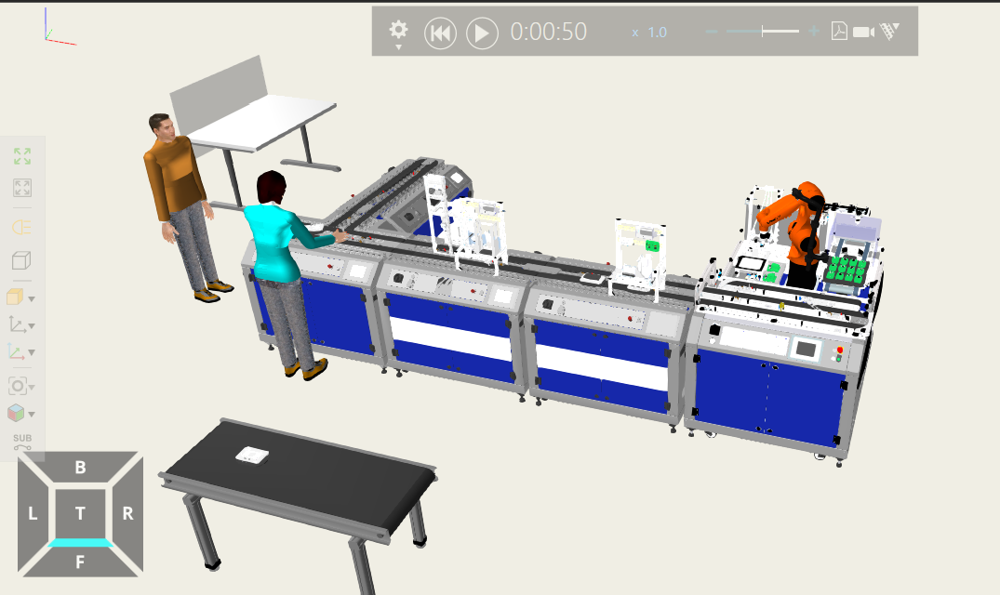

### Simulation controlled by PLC using OPC UA
In this model it was demonstrated how a physical or emulated PLC could be connected to VC-signals to control the production/simulation flow. The connection was made by pairing PLC variables to VC signals using OPC UA. Specifically, the PLC changes the state of the stopper variable to either stop components or letting them pass at the respective stations. To run this, enable the connectivity add-on (Premium Only) and connect to the PLC controlling the stopper i.e. either the physical Festo PLC on the Smart Production Lab or the emulated Codesys PLC.

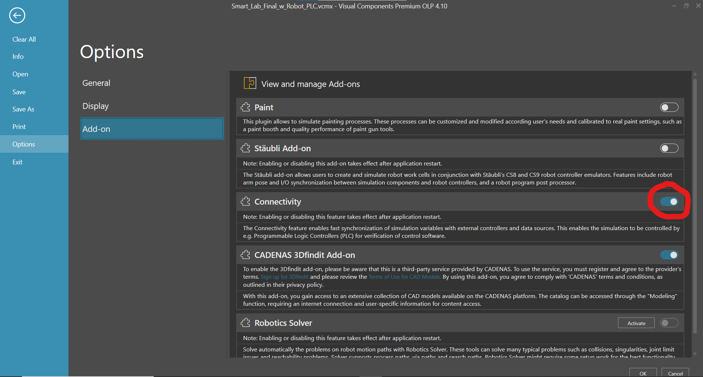    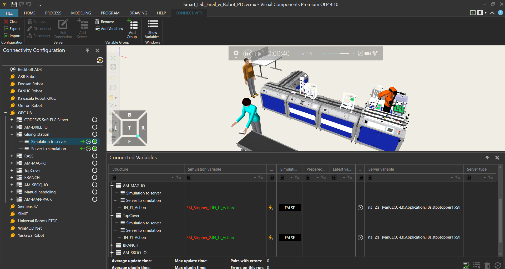

For more detail on how to set up the connectivity between a PLC and Visual Components please watch the following tutorial on YouTube:
[VC-PLC Connection](https://www.youtube.com/watch?v=nk0UJIcC7L8)

**Demo video:**
[Multiple Media Breaks](https://youtu.be/1VPNwdHrswQ?si=0ezJ8uyocEeJdh52)

### Two VC instances connected with MQTT and Omniverse
This demo uses MQTT communication to "synchronize" two VC simulation instances. The Smart Production Lab has been split in two separate VC layouts. By creating a live connection to each VC instances in Omniverse the two models are visually shown together. Note, this requires the Omniverse Connector plugin, which does not work well and can only be installed by sending an email requets to VC. However, Omniverse is not essential for the demo as the logic is solely dependent on the MQTT communication. For more details on connecting Omniverse to VC please see the video: [2x VC Omniverse Detailed](https://youtu.be/gz5-jinmJpQ?si=5xDNniQslm45h8f-)

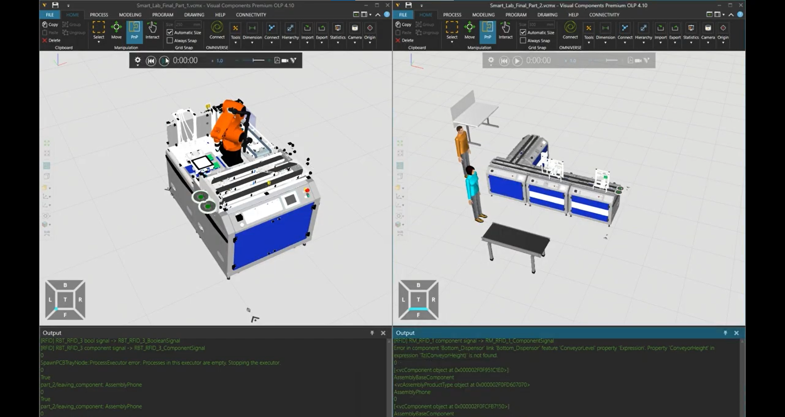   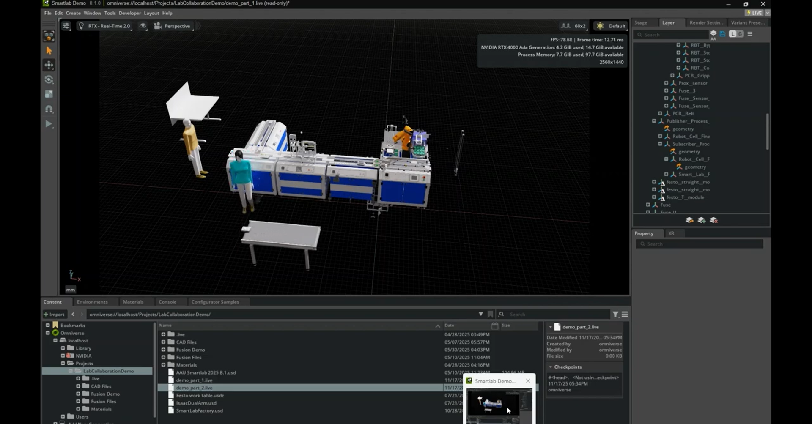

The "transfer" of components between the conveyors of the respective layouts is performed by a combination of MQTT messaging the other layout that a component is inbound and a process node spawning the signalled components. The MQTT communicatio requires a python 2.7 compatible version of the Paho library to be installed into the site-packages of the VC python install. For this demo the Mosquitto broker was used. The emulated PLC code can be found in "Code/PLC_VisualComponents_OPCUA".

**Receiver example:**

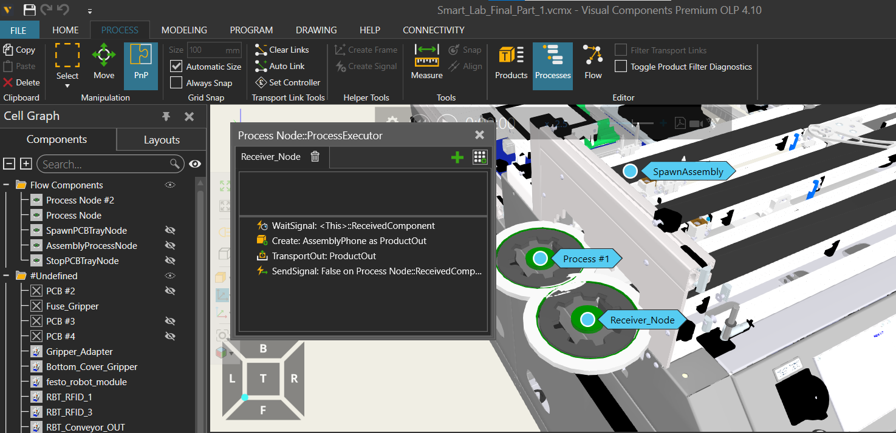    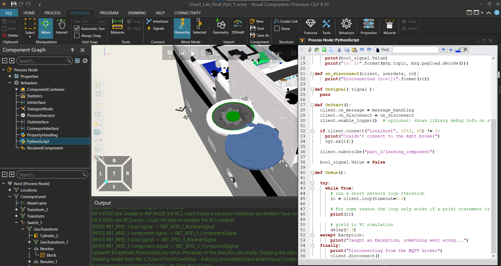

**Sender example:**

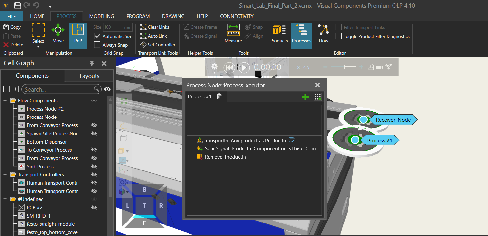    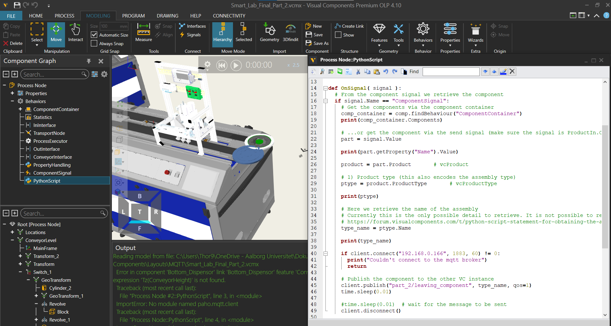

**Demo video:**
[2x VC Omniverse](https://youtube.com/shorts/1VPNwdHrswQ?feature=share)

### Simulation controlled by MES4
In this demo it was tested how a MES system (Festo MES4) could be integrated with Visual Components to control the operations in the simulation. A combination of using python, VC signals and process nodes was used. Python is used to create a socket connection to MES4, from which it can request order information. By writing the received order info to VC signals it becomes available for process nodes to access. Thereby, the logic in the process nodes are based on what the signal values are. Especially, the integer signal, OpNo, storing the operation number received from MES4, is important and is used by if/else/switch statements to determine what operation to perform in the simulation. As the RFID-reader component is present at all stations, signals and a generic python script was added to it to create a standard component able to communicate with MES4. Thereby, adding a new station only requires copying the RFID-reader from one of the other stations and writing proper process logic i.e. no scripting should be needed - unless the OpNo info is not enough and the MES4 message therefore must be changed.

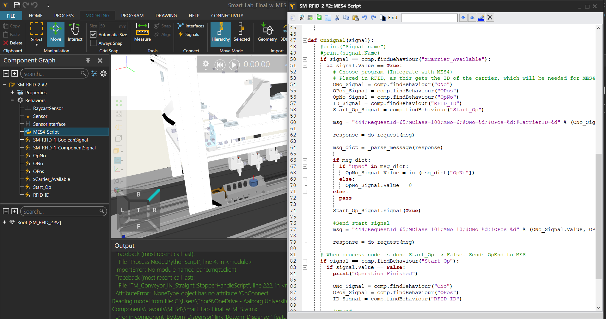   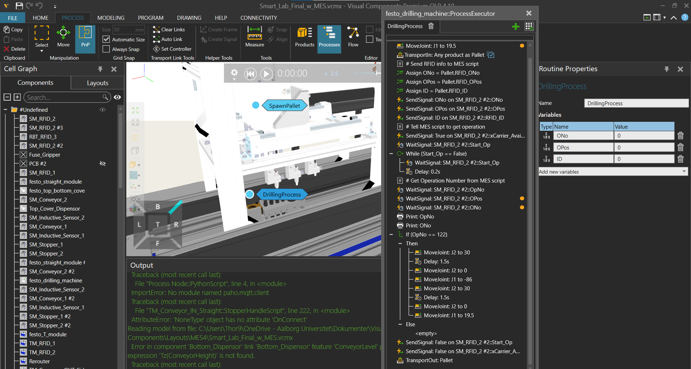

>[!NOTE]
>The python script is opening and closing sockets each time info from MES4 is requested. This slows the simulation. A more efficient implementation where the socket is kept open should be possible.

### Simulation connected with PLC and MES4
This demo is similar to the one above. However, in this the drilling station communicates with MES4 using an emulated PLC instead of the python script. The emulated PLC is connected thorugh OPC UA to the same signals on the RFID-reader component as the python script was. This makes it easy to switch between python or PLC communication to MES4, as the logic in the process node does not have to be changed. The emulated PLC code can be found in "Code/Smartlab_PLC_MES_VisualComponents_demo". The code is a modified version of the code running on the actual Smartlab Production Lab. The most interesting code block is found under the POU tab and "Programs/StopperWithMes/Private/_MesMode", as this is the code communicating with MES4 and in this case changing the variables connected to the VC signals. See "MES4_Com_Guide.odt" for more info.

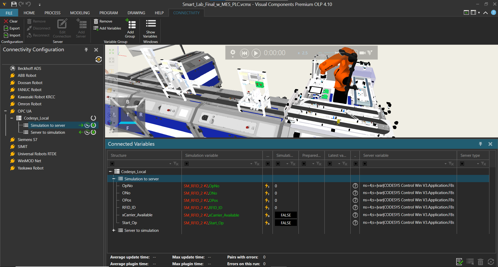   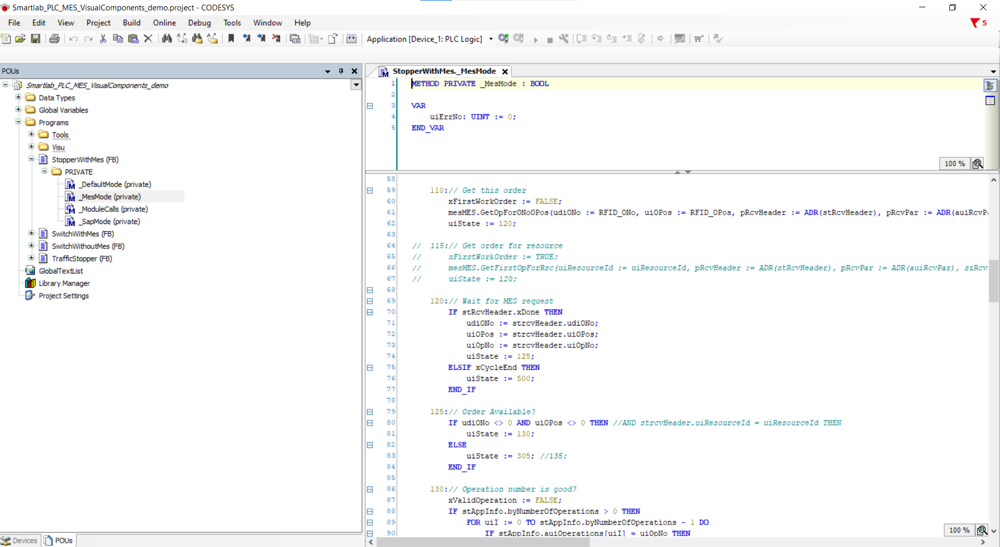

**Demo video:**
[MES VC PLC Demo Final](https://youtu.be/QYtptjzPPI0?si=eKimEA4REmdafqEX)

## Contributors
The demonstrators has mainly been developed by Thor Kryhlmand Iversen and Silas Jensen.

<section id="sec_contributors">
<table>
  <tr> 
    <td align="center"><a target="_blank" rel="noreferrer noopener" href="https://github.com/thor2643"> <b>Thor Kryhlmand</b></a> <a href="gttps://github.com/thor2643" title="">👨‍🌾</a></td>
    <td align="center"><a target="_blank" rel="noreferrer noopener" href="https://github.com/silasjensen2001"> <b>Silas Jensen</b></a> <a href="gttps://github.com/silasjensen2001" title="">🤠</a></td>
  </tr>
</table>
